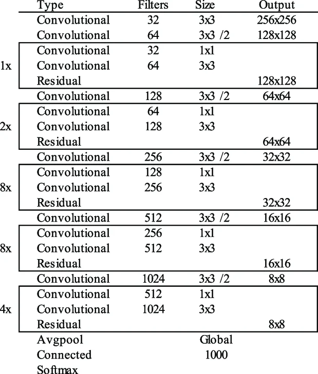
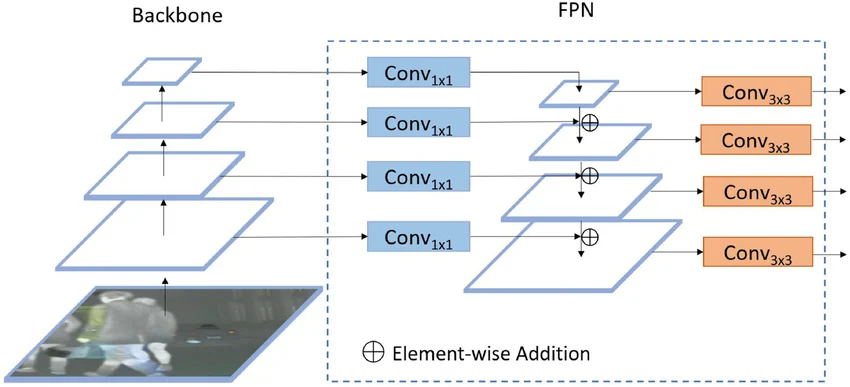
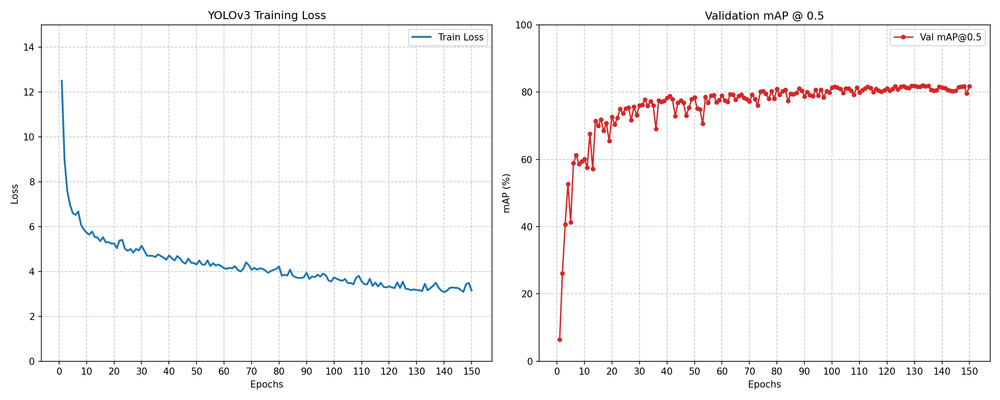

# YOLOv3-VOC

This is a modified **YOLOv3** implementation.

| Model  | Train Dataset              | Val Dataset  | Epochs | Time  | Input Size  | Test Size | mAP@0.5 | mAP@0.6 | mAP@0.75 |
|:-------|:---------------------------|:-------------|:-------|-------|:------------|:----------|:--------|:--------|:---------|
| YOLOv3 | VOC2007 + VOC2012 trainval | VOC2007 test | 150    | 7.24h | multi-scale | 640x640   | 81.97%  | 77.98%  | 60.26%   |

## Structure

```
├── data/
|   └── VOCdevkit
├── model/
|   ├── __init__.py
|   ├── yolov3_backbone.py
|   ├── yolov3_neck.py
|   ├── yolov3_fpn.py
|   ├── yolov3_head.py
|   └── yolov3.py
├── config.py
├── voc.py
├── augmentation.py
├── matcher.py
├── loss.py
├── eval.py
├── train.py
└── test.py
```

## What's new?

#### <em>Backbone Network</em>:

*Darknet-53* plays a critical role in the performance of YOLOv3 object detection system. It comprises 53 convolutional
layers, making it deeper and more powerful. This increase in depth allows the
network to capture more complex features, improving its detection capabilities.

<br>
<p align="center">
  
  <br>
  <em><strong>DarkNet-53</strong></em>
</p>

#### <em>Multi-level Detection & FPN</em>:

For a Convolutional Neural Network (CNN), as the layers get deeper and the downsampling increases, feature maps at
different depths naturally carry different levels of spatial information (localization) and semantic information (
classification).

Feature maps from shallower layers haven't been "over-processed" by many convolutions, so their semantic information is
relatively low. However, because they haven't gone through much downsampling, they
retain rich spatial information. In contrast, deeper feature maps are the exact opposite. After passing through plenty
of layers, they have richer semantic informations, but the spatial
info gets weaker by too much downsampling. This leading to poor performance on small object detection. At the same time,
as the depth increases, the
receptive field grows, allowing the network to learn large objects more fully, which generally improves large object
detection ability.

After recognizing this trade-off, a simple solution is: let shallow features handle small objects, and let deep features
take care of those large ones. Feature Pyramid Networks (FPN) introduces a top-down feature fusion structure, using
spatial upsampling to continuously integrate high-level semantic information from deep layers into shallower feature
maps.

<br>
<p align="center">
  
  <br>
  <em><strong>Feature Pyramid Networks (FPN)</strong></em>
</p>

Here, I used three feature maps C3, C4, and C5 with downsampling strides of 8, 16, and 32. For each feature map, three
anchor boxes are assigned to every grid cell:

- For C3 feature map, anchors (10,13), (16,30), and (33,23) are used for detecting small objects.
- For C4 feature map, anchors (30,61), (62,45), and (59,119) are used for detecting medium-sized objects.
- For C5 feature map, anchors (116,90), (156,198), and (373,326) are used for detecting large objects.

## Train

To start training, run the command -

```
python train.py
```

After training finishes, the loss and mAP@0.5 curves will be displayed.

<br>
<p align="center">
  
  <br>
  <em><strong>Loss and mAP@0.5</strong></em>
</p>

## Test

To test your trained model, run the command -

```
python test.py
```

It will randomly select an image in the test set, and then output the model's prediction results. You can also try your
own images!
